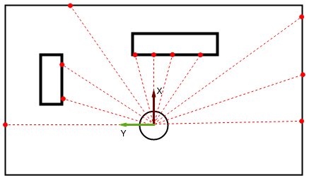

# Differential Drive

Differential drive robots have two active wheels that are controlled separately. The angle of the wheels relative to the robot base is fixed, and steering is performed by modulating the speed difference between the wheels. Due to the simplicity of its design, the differential drive is one of the most common locomotion methods for wheeled robots.

In the video below, Prof. Burgard explains the details of the differential drive design and its kinematics.

You can also download the corresponding slides Download slides for reference.

## Further reading

Of course, also other forms of wheeled drives are used in mobile robots, e.g., Ackermann drive, synchronous drive, Mecanuum wheels, etc. Though this is not strictly necessary for the course, we recommend you to get an overview of other wheeled locomotion methods. You can use this article Links to an external site. as a starting point.

# Range sensing using a LiDAR

## Range sensors

A range sensor measures the distance to the closest surface, the measurement usually being associated with a specific direction. Knowing the range to nearby surfaces is crucial in mobile robotics since it is required by many algorithms for obstacle avoidance, localization, and navigation. Depending on the deployment area and task of the robot, a variety of methods for range estimation can be used.

For example, stereo cameras are cheap and generate a dense depth image. However, their operational range is limited by the baseline between the cameras and the measurement quality depends on lighting and weather conditions. An ultrasound sensor is also cheap and works under any lighting condition, but is reliable only on short distances and suffers from other error sources like crosstalk or reflections. Laser range scanners, or LiDARs, provide very reliable measurements at distances up to 100 meters, however, the quality comes at relatively high hardware costs.

# LiDARs

Laser range scanners work based on the time-of-flight principle: The sensor emits a laser beam, that beam is reflected by a surface, and the reflected signal is registered by the sensor. The distance to the surface is then derived from the time $\Delta t$ between emission and registration. If $ c $ is the speed of light, then the distance $ d $ is given by $d =( \Delta . c) / 2$.

The direction of the beam is controlled by a spinning mirror, allowing the sensor to sample the range at different viewing angles 
$[
θ_1
,
θ_2
,
.
.
.
,
θ_n
]$
. The field of view (FoV) of a LiDAR is the difference between the starting angle 
$θ_1$
 and the end angle 
$θ_n$
, with the other 
$θ_i$
 being uniformly sampled between these bounds. The FoV depends on sensor construction and can reach 
$360^\circ$
, the FoV of the Sick LiDAR shown on the left (and the one used in the assignment) is 
$180^\circ$. The figure on the right schematically depicts a scan of a LiDAR with a $180^\circ$ FoV. 

A raw LiDAR scan is an array of length 
$n$
 of range measurements 
$[
d_1
,
d_2
,
.
.
.
,
d_n
]$
. The coordinates 
$(
x_i
,
y_i
)$
 of the beam endpoints, shown as red dots in the figure on the right, can be computed with 
$x_i = d_i⋅cos
⁡
(
θ_i
)$
 and 
$y_i = d_i
⋅
sin(
θ_i
)$
, where 
$θ_i$ is the angle of the 
$i$ th measurement. Here we use the convention that the angle is measured counter-clockwise from the 
x-axis with 
$θ_1 = 90^\circ$
 and 
$θ_n =
−90^\circ$.