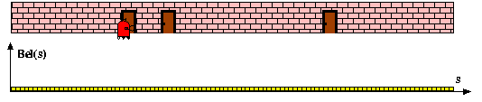
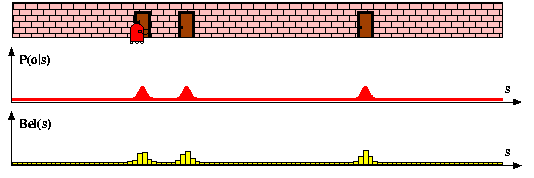
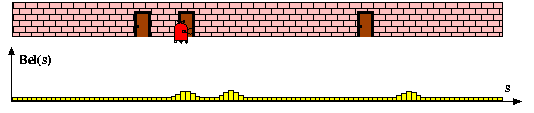

# Discrete Bayes Filter
One way to approximate a continuous belief distribution is to decompose the state space into a finite number of intervals and for each to maintain the probability of the state variable falling within that interval. The Bayes filter that is based on such discretization is known as the discrete Bayes filter or the histogram filter. Here we outline one version of the discrete Bayes filter by means of an example.

Consider the problem of localizing a robot moving in a 1D world as shown in the figure below. We split the state space $s$ into $n$ equally-sized intervals where $s_k$ is the center of the 
$k$ th interval. The initial belief $Bel_0(s_k)$ (the height of the yellow bars) is set to $1/n$ for all intervals.

Next, we integrate the observation 
$o$
 of a door. The continuous measurement likelihood 
$p
(
o
∣
s
)$
 is depicted in red. In order to update the belief, 
$p
(
o
∣
s
)$
is evaluated at the center of each interval and multiplied by the previous belief, i.e., 
$B
e
l_1
¯
(
s_k
)=p
(
o
∣
s_k
)
B
e
l_0
(
s_k
)$
. To obtain a proper probability distribution, 
$Bel_1^-$ is then re-normalized.

Finally, we integrate a motion action 
u
. The updated belief 
$Bel_2
(
s_k
)$is the summed-up likelihood of the robot moving from any interval 
$i$to interval 
$k$
given 
$u$
, weighted by 
$Bel_1
(
s_i
)$
. In other words, 
$Bel_2
(
s_k
)=\sum_i
p
(
s_k
∣
u
,
s_i
)
Bel_1
(
s_i
)$
. We note that the computational complexity of the motion update step is 
$O
(
n^2
)$
.

The discrete Bayes filter can also be applied to higher-dimensional state spaces. For instance, to localize a robot on a plane, the belief would be represented by a 3D grid with two axes for the 
$(
x
,
y
)$
-position and one axis for the orientation 
$\theta$
. Depending on the resolution of the grid and the size of the environment, the memory requirements and the computational costs for the motion update can become prohibitively large. Though there are approaches to reduce these costs, in the next section we will learn a more efficient filter, namely the particle filter.