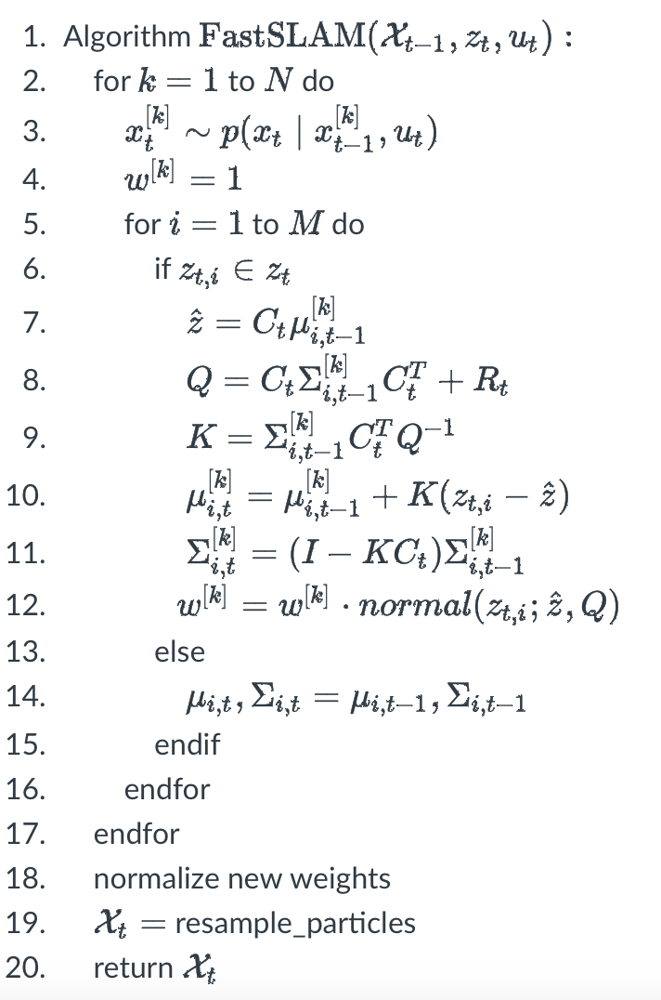

# The SLAM Problem
In robot localization, we want to estimate the posterior distribution of the robot trajectory 
$p
(
x_0
:
t
∣
m
,
z_1
:
t
,
u_1
:
t
)$
where $x_0
:
t$ are the robot poses up to time step 
$t
, 
m$ is the map, and 
$z_1
:
t$
and 
$u_1
:
t$ are the series of observations and controls. The problem of mapping with known poses is to compute the posterior 
$p
(
m
∣
x_0
:
t
,
z_1
:
t
)$ of the map given the robot trajectory and observations. The SLAM problem is the estimation of the joint posterior of the trajectory and map, given measurements and controls, i.e., 
$p
(
x_0
:
t
,
m
∣
z_1
:
t
,
u_1
:
t
)$. The difficulty of SLAM arises from the interdependency of the map and robot poses: localizing the robot requires a map and for integrating the observations into the map the robot poses are needed.

The slides below further detail the SLAM problem. In this module, we will introduce one specific solution to SLAM, namely FastSLAM. That algorithm is based on the particle filter and the Kalman Filter, which is presented in the next section.

# Kalman Filter
## Definitions
The Kalman Filter (KF) is an implementation of the Bayes filter where the belief, the transition model, and the measurement model follow a Gaussian distribution. In that case, the filtering process can be efficiently computed by a number of linear algebra operations. Let 
$x_t$
be a vector of length 
$n$ representing the state at time 
$t
, 
u_t$ the control vector of length 
$l$, and 
$z_t$
the vector of measurements of length 
$k$
. Then, the belief of the current state is a 
$n$
-dimensional normal distribution with mean 
$μ_t$ and covariance matrix 
$Σ_t$ :

$b
e
l
(
x_t
)= N
(
x_t
;
μ_t
,
Σ_t
)$ .

That is, the Kalman Filter only needs to store the 
$(
n
×
1
)$ vector 
$μ_t$ and the 
$(
n
×
n
)$ matrix 
$Σ_t$
to represent the belief. To perform the recursive belief update we also need to define the transition and the measurement models. The transition model is

$p
(
x_t
∣
u_t
,
x_t
−
1
) = N
(
x_t
;
A_t
x_t
−
1
+
B_t
u_t
,
Q_t
)$ ,
where 
$A_t
is a 
$(
n
×
n
)$
matrix that determines how the state evolves without the control input and noise and 
$B
_t$
is a 
$(
n
×
l
)$
matrix that describes how the control 
$u_t$ influences the next state. 
$Q_t$ is the 
$(
n
×
n
)$ covariance matrix that accounts for the noise of the transition model.

The measurement model is

$p
(
z_t
∣
x_t
)= N
(
z_t
;
C_t
x_t
,
R_t
)$
,

where the 
$(
k
×
n
)$
matrix 
$C_t$
maps the state 
$x_t$
to the observation 
$z_t$
and the 
$(
k
×
k
)$
covariance matrix 
$R_t$
determines the measurement noise.

## Kalman Filter Algorithm

It can be shown that the recursive Bayes filter with the above assumptions and definitions corresponds to the Kalman Filter algorithm. The KF algorithm consists of a prediction and a correction step:

1. Algorithm 
$ Kalman_filter
(
μ_{t−1}
,
Σ_{t
−
1}
,
u_t
,
z_t
)
:$

2. Prediction:
  
$ μ^-_t =
A_t
μ
_ {t
−
1}
+
B_t
u_t$ 
   
$Σ^- _t =
A_t Σ
_{t
−
1}
A_t^T
+
Q_t $ 

3. Correction:
  
$ K_t =
Σ^-_t
C_t^T
(
C_t
Σ_t^¯
C_t^T
+
R_t
)^{-1}$

  
$μ_t =
μ_t^
¯
+
K_t
(
z_t
−
C_t
μ_t^¯
)$
  
$Σ_t =
(
I
−
K_t
C_t
)
Σ_t^¯$

4. return 
$μ_t
,
Σ_t$
In the prediction step, an intermediate belief distribution is computed using the transition model. That is analogous to sampling new particles from the motion model in the particle filter. The correction step then integrates the current observation w.r.t. to the measurement model and updates the intermediate belief accordingly. In the particle filter, that corresponds to computing new particle weights.

In the above equations, 
$(
)^
T$
 denotes the matrix transpose, 
$(
)^{−
1}$
matrix inversion, and 
$I$ the identity matrix.

# FastSLAM

## SLAM with Particle Filters

As discussed in the previous course part, the particle filter is a general method for Bayesian state estimation that does not make assumptions about the form of the belief distribution. Ideally, we want to keep that generality in SLAM. In principle, the SLAM problem could be approached with a particle filter similar to localization. We can consider the robot pose and the map as a joint state variable 
$⟨
x
,
m
⟩$
 and estimate the belief 
$b
e
l
(
x
,
m
)$
 using the standard PF algorithm. That would require covering the state space with a sufficient number of particles, which in practice would quickly become intractable due to the curse of dimensionality. Consider a landmark-based map representation with 
$M$
 landmarks, i.e., 
$m =
⟨
l_1
,
.
.
.
,
l_M⟩
$

. The state space would then have at least 
$M$
dimensions, where in practical applications hundreds or thousands of landmarks are used. 

## FastSLAM Idea
The core idea of FastSLAM is to deploy the particle filter only for pose estimation and use a more efficient estimator for the map, e.g., the Kalman Filter. Recall that the full SLAM posterior is 
$p
(
x_0
:
t
,
m
∣
z_1
:
t
,
u_1
:
t
)$
. Using the rule of conditional probability it can be factored as

 
$p
(
x_0
:
t
,
m
∣
z_1
:
t
,
u_1
:
t
) =
p
(
x_0
:
t
∣
z_1
:
t
,
u_1
:
t
)
⋅
p
(
m
∣
x_0
:
t
,
z_1
:
t
)$
.

Though FastSLAM can be adapted to different map representations, here we focus on the landmark-based map 
$m =
⟨
l_1
,
.
.
.
,
l_M
⟩$
. Using the fact that the landmarks are independent given the poses we can rewrite the map posterior as a product of individual landmark posteriors:

$p
(
x_0
:
t
,
l_1
:
M
∣
z_1
:
t
,
u_1
:
t
) =
p
(
x_0
:
t
∣
z_1
:
t
,
u_1
:
t
)
∏_
i^
M
p
(
l_i
∣
x_0
:
t
,
z_1
:
t
)$
.

Assuming that 
$p
(
l_i
∣
x_0
:
t
,
z_1
:
t
)$
 is normally distributed, the product on the right can be computed with 
$M$
 Kalman Filters while the pose hypotheses are represented by particles. In FastSLAM, a particle thus holds a pose hypothesis and its own map estimate consisting of 
$M$
 Kalman Filters. In the case of a 2D world, we aim to estimate the 2D coordinates of each landmark, and therefore each Kalman Filter stores a 
$(
2
×
1
)$
 mean vector and a 
$(
2
×
2
)$
 covariance matrix.

## FastSLAM Algorithm
On the top level, the FastSLAM algorithm is similar to the particle filter:

1. Prediction: Sample a new set of particles according to the current control input and the motion model.
2. Correction: Update the landmark estimates using the current measurement and calculate new importance weights.
3. Resampling: Sample a new set of particles according to the importance weights.

The prediction and resampling steps are essentially the same as in the standard particle filter. The landmark estimates are updated according to the KF correction step. Let 
$X$
 be the set of 
$N$
 particles, 
$x
[
k
]$
 the pose hypothesis of particle 
$k$
, and 
$w
[
k
]$
 its importance weight. Further, 
$M$
 is the total number of landmarks, 
$z_t
,
i
∈
z_t$
the measurement of the 
$i$
th landmark (if it was observed in that step), 
$μ_
i
[
k
]$
 is the mean of that landmark associated with particle 
$k$
, and 
$Σ_i
[
k
]$
 the corresponding covariance. With that, the FastSLAM algorithm is:

In line 8, 
$Q$
 is the so-called measurement covariance. Further note that above the matrix 
$C_
t$
 maps a landmark position to a landmark measurement.

## Final Remarks
In the FastSLAM version presented here, we assume that the correspondence between landmarks and landmark measurements is known. We further assume that the measurement model for landmarks follows a Gaussian distribution. However, this assumption can be dropped by using Extended Kalman Filters (EKFs) as proposed in the original paper.